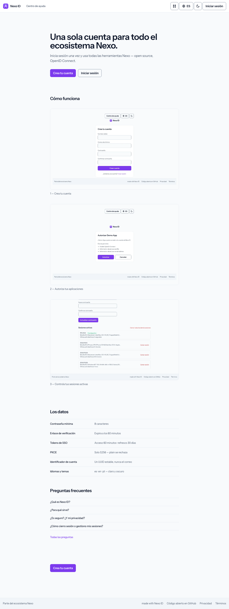
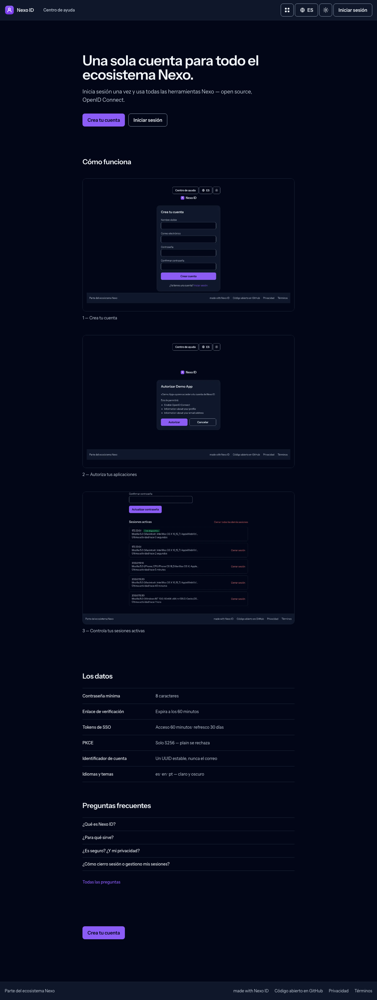
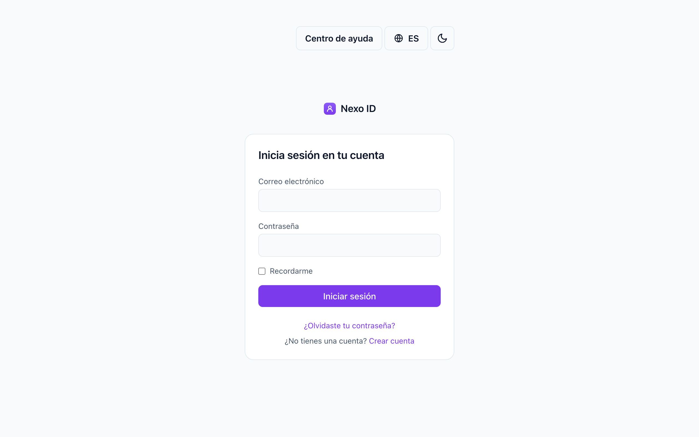
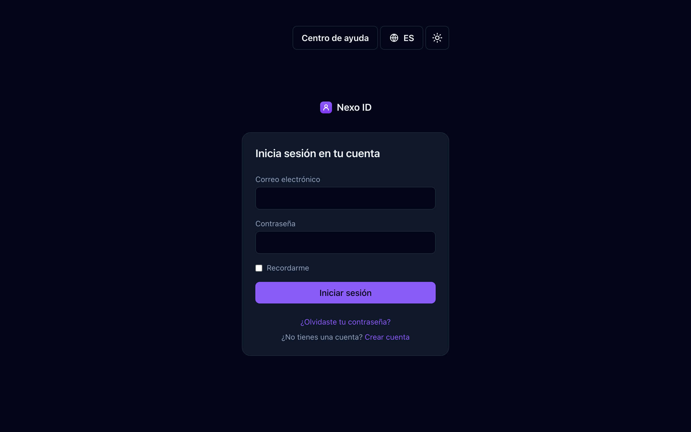

# Nexo ID

**One account for every Nexo tool — the open-source identity provider (OAuth 2.0 / OIDC single sign-on) of the Nexo ecosystem.**
Self-hostable, standards-based, no external requests.

[**Live demo**](https://nexoid.alvarocdev.com) ·
[Integration guide](docs/INTEGRATION.md) ·
[Deployment guide](DEPLOYMENT.md) ·
[Scope](docs/SCOPE.md)

---

Nexo ID is the **central identity service (SSO) of the Nexo ecosystem**: one account,
every Nexo tool. It's a self-hostable, standards-based **OAuth 2.0 + OpenID Connect
provider**, so each product stays separate in data and logic, connected only by
identity. Like its siblings, it is open source and multi-instance — use the hosted
instance or run your own. It is **live in production at
[nexoid.alvarocdev.com](https://nexoid.alvarocdev.com)**.

## Why Nexo ID?

- **One account, every tool** — users register once and sign into any Nexo tool. New
  tools are born integrated instead of building authentication all over again.
- **Standards-based OIDC** — OAuth 2.0 authorization-code flow with **PKCE (S256
  enforced)** and a full OpenID Connect identity layer: `id_token`, `userinfo`,
  discovery (`/.well-known/openid-configuration`) and JWKS. Any client, on any domain,
  stack or host, integrates with off-the-shelf OIDC libraries.
- **Silent SSO + central logout** — an active Nexo ID session signs the user into any
  tool without re-entering credentials; RP-initiated logout ends the session and
  redirects only to validated URIs (never an open redirect).
- **Secure by default** — email verification (blocking for SSO use), per-account and
  per-IP rate limiting on login / registration / recovery, single-use hashed recovery
  tokens, password-change email notifications, `Secure` + `HttpOnly` + `SameSite`
  cookies, strict CSP + security headers, and a dependency audit in CI.
- **Session control** — users list and revoke their active sessions (individually or
  all others) from their profile.
- **Self-hostable** — run your own identity provider for your own ecosystem, or point
  your tools at the hosted instance.
- **Private by design** — **zero external requests** at runtime (no CDNs, no font
  services, no trackers); SMTP only for transactional mail.
- **Multilingual** — English, Spanish and Portuguese (`en`/`es`/`pt`) with a
  translatable `/help` center.

## Screenshots

Captured from a local instance seeded with `DemoSeeder`, by
`node ~/alvaro/scripts/nexo-shots.mjs .` — never from anyone's real account.

| Light | Dark |
| --- | --- |
|  |  |
|  |  |

See it for real at the [live demo](https://nexoid.alvarocdev.com).

## Tech stack

PHP 8.3+ · Laravel 13 · Blade + Alpine.js + Tailwind CSS (Vite) · MySQL

OIDC built on [Laravel Passport](https://laravel.com/docs/passport) +
[laravel-openid-connect](https://github.com/jeremy379/laravel-openid-connect).
Quality: [Pest](https://pestphp.com) · [Pint](https://laravel.com/docs/pint) ·
[Larastan](https://github.com/larastan/larastan) · GitHub Actions CI.
Zero external runtime requests — system font stack, no CDNs.

## Self-hosting

A standard Laravel app: PHP 8.3+, MySQL, and anything from cheap shared hosting to a
VPS. Multi-instance by design — run your own identity provider for your own ecosystem
instead of depending on someone else's.

**[DEPLOYMENT.md](DEPLOYMENT.md)** has the real steps: running it locally, the
environment reference and the production deploy (Passport keys, forced HTTPS, the
OIDC specifics). Integrating a client is documented in
[docs/INTEGRATION.md](docs/INTEGRATION.md) and [SPEC-client.md](SPEC-client.md).

## Documentation

- [Scope](docs/SCOPE.md) · [Architecture](docs/ARCHITECTURE.md) · [Integration](docs/INTEGRATION.md)
- Specs: [core](SPEC.md) · [SSO provider](SPEC-sso.md) · [reusable client](SPEC-client.md)
- [Plan & gates](docs/PLAN.md) · [Decisions (ADRs)](docs/adr/)
- [Deployment guide](DEPLOYMENT.md)

## Nexo ecosystem

Nexo is a family of open-source, self-hostable tools that share one visual identity,
one optional account ([Nexo ID](https://github.com/nexo-tools/nexo-id) SSO) and one set of
engineering standards. Every tool runs **fully standalone** — the ecosystem is opt-in.

| Tool | What it is | Live | Repo |
| --- | --- | --- | --- |
| **Nexo Tools** | Ecosystem hub — discover the tools and hop between them with one account | [nexotools.alvarocdev.com](https://nexotools.alvarocdev.com) | [nexo-tools](https://github.com/nexo-tools/nexo-tools) |
| **Nexo ID** | One account for every tool — OAuth 2.0 / OIDC SSO | [nexoid.alvarocdev.com](https://nexoid.alvarocdev.com) | — you are here |
| **Nexo Links** | Link-in-bio you host yourself (Linktree alternative) | [nexolinks.alvarocdev.com](https://nexolinks.alvarocdev.com) | [nexo-links](https://github.com/nexo-tools/nexo-links) |
| **Nexo Agenda** | Bookings for service businesses (Fresha / Booksy alternative) | [nexoagenda.alvarocdev.com](https://nexoagenda.alvarocdev.com) | [nexo-agenda](https://github.com/nexo-tools/nexo-agenda) |
| **Nexo Short** | URL shortener with private, cookieless stats | [nexoshort.alvarocdev.com](https://nexoshort.alvarocdev.com) | [nexo-short](https://github.com/nexo-tools/nexo-short) |
| **Nexo Events** | Event tickets, passes and QR check-in | [nexoevents.alvarocdev.com](https://nexoevents.alvarocdev.com) | [nexo-events](https://github.com/nexo-tools/nexo-events) |

New to Nexo? Start at **[nexotools.alvarocdev.com](https://nexotools.alvarocdev.com)**.
Built by **[alvarocdev.com](https://alvarocdev.com)** — the tech behind Nexo.

## License

MIT License © [Alvaro Carrizales](https://alvarocdev.com) — the tech behind Nexo.

---

Status: **live** at [nexoid.alvarocdev.com](https://nexoid.alvarocdev.com) — OAuth 2.0 + PKCE /
OIDC (authorize, token, `id_token`, userinfo, discovery, JWKS), silent SSO and central logout,
with five sibling tools authenticating against it in production.
